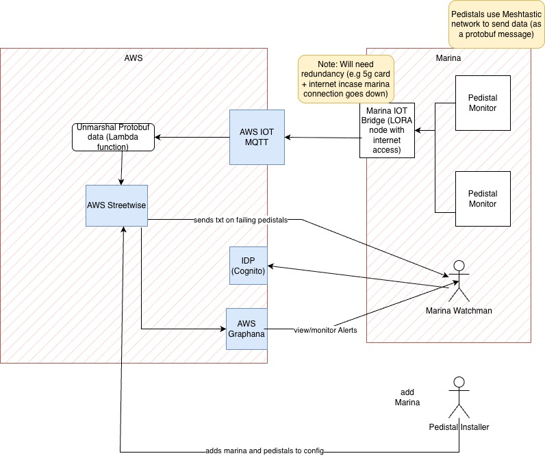

# Minimal Viabable Project Architecture

This section has notes on the minimal setup to have a working system that will monitor electricity usage on pedistals. From this we will build out more features.

# Barebones Requirements

1. Send SMS messages with a description of the pedistal that is no longer working
2. Provide Summary of the pedistals in a marina - need to easily assess if they working or not?

# Proposed MVP Architecture

Key
- Blue : AWS Component
- White : to be developed
 
 # Notes

 1. Meshtestic (https://meshtastic.org) used to comminicate from and to the gateway node.
 2. Bridge (Gateway)  node is setup to point to AWS IOT MQTT service. This means that data can get to AWS simply by setting up the Gateway node using the standard Meshtastic UI.
 3. (Optional) add a backup phone modem to the Bridge incase the internat is down for high availability
 4. Use Streetwise to process the events and do the alterting. Nick will have to setup Streetwise per pedistal which may not be the easiest way to do this but for MVP, it will get things going
 5. Streetwise as an SMS altering service we can use.
 6. Graphana to view data for MVP. We may build better UI after MVP based on feedback
 7. Pedistal IOT device will read voltage/current flowing through pedistal and send that number as a data at a regular frequence (configurable but expect to be every 10mins).

 This gets the project up and running by leveraging AWS. Once running we can get feedback and refine.
